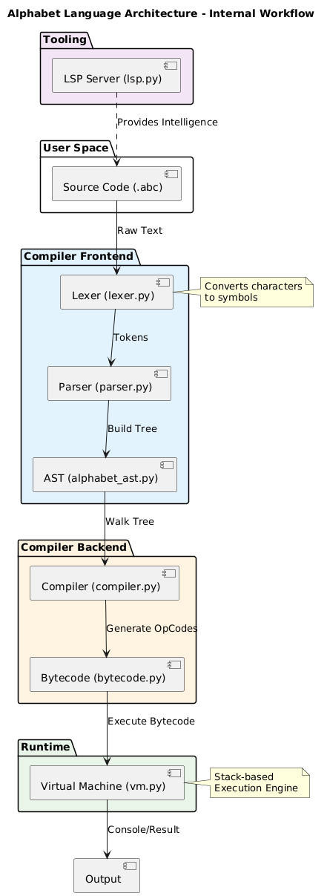

```text
            d8b            d8b                 d8b
           88P            ?88                 ?88                d8P
          d88              88b                 88b            d888888P
 d888b8b  888  ?88,.d88b,  888888b  d888b8b    888888b  d8888b  ?88'
d8P' ?88  ?88  `?88'  ?88  88P `?8bd8P' ?88    88P `?8bd8b_,dP  88P
88b  ,88b  88b   88b  d8P d88   88P88b  ,88b  d88,  d8888b      88b
`?88P'`88b  88b  888888P'd88'   88b`?88P'`88bd88'`?88P'`?888P'  `?8b
                 88P'
                d88
                ?8P
```

# Alphabet Programming Language v2.0
**Native C++ Compiled Ecosystem**

**Developed by Fraol Teshome** (`fraolteshome444@gmail.com`)

[](https://opensource.org/licenses/MIT)
[](https://github.com/fraol163/alphabet/actions)
[](#-installation)
[](https://en.cppreference.com/w/cpp/17)

---

## 🚀 Overview

**Alphabet** is a high-performance, compiled programming language featuring extreme code density through single-character keywords. Now rewritten from Python to **native C++**, Alphabet delivers:

- ⚡ **10-100x Performance** - Native compiled binary vs interpreted Python
- 🔒 **Strong Static Typing** - Compile-time type validation
- 🎯 **Zero-Copy Lexing** - `std::string_view` for maximum speed
- 🧠 **Smart Memory** - Fixed-size stack, no heap fragmentation
- 🔌 **FFI Support** - Link external C/C++ libraries
- 💻 **LSP Integration** - VS Code real-time error highlighting

---

## 📦 Quick Install

### From GitHub Actions (Recommended)
1. Visit **[Actions](https://github.com/fraol163/alphabet/actions)**
2. Select **latest build** → Download artifact for your OS
3. Extract and run

### Build from Source
```bash
# Prerequisites: CMake 3.16+, C++17 compiler (g++, clang++, or MSVC)

git clone https://github.com/fraol163/alphabet.git
cd alphabet
mkdir build && cd build

# Standard build
cmake -DCMAKE_BUILD_TYPE=Release ..
make -j$(nproc)

# Install globally
sudo make install

# Verify
alphabet --version
```

### Package Managers (Coming Soon)
```bash
# Ubuntu/Debian
sudo apt install alphabet-lang

# macOS (Homebrew)
brew install alphabet

# Windows (Chocolatey)
choco install alphabet
```

---

## 🎯 Language Features

### Single-Character Keywords
| Letter | Keyword | Example |
|--------|---------|---------|
| `i` | If | `i (x > 0) { }` |
| `e` | Else | `i (...) { } e { }` |
| `l` | Loop | `l (x > 0) { }` |
| `c` | Class | `c MyClass { }` |
| `v` | Public | `v m 1 f() { }` |
| `p` | Private | `p 1 x = 10` |
| `m` | Method | `v m 1 add() { }` |
| `n` | New | `15 obj = n MyClass()` |
| `r` | Return | `r x + y` |
| `z` | System | `z.o("Hello")` |

[**Full Keyword Reference**](docs/DOCUMENTATION.md)

### Numeric Type System
| ID | Type | Example |
|----|------|---------|
| 1-4 | Integers (i8-i64) | `1 x = 10` |
| 5 | Generic int | `5 n = 100` |
| 6-8 | Floats (f32-f64) | `6 pi = 3.14` |
| 11 | Boolean | `11 ok = (1 == 1)` |
| 12 | String | `12 s = "Hello"` |
| 13 | List | `13 arr = [1, 2, 3]` |
| 14 | Map | `14 m = {"key": 1}` |
| 15+ | Custom Classes | `15 obj = n MyClass()` |

**Type IDs 15+ are unlimited** - register custom types dynamically!

---

## 📖 Usage

### File Extension
Alphabet source files use the `.abc` extension.

### Magic Header Requirement
**Every `.abc` file must start with a magic header:**
```alphabet
#alphabet<en>
```
This identifies the file as Alphabet source code. Without it, compilation fails.

### Hello World
```alphabet
#alphabet<en>
12 greeting = "Hello, Alphabet!"
z.o(greeting)
```

### Object-Oriented Programming
```alphabet
#alphabet<en>
c Calculator {
  v m 5 add(5 x, 5 y) {
    r x + y
  }
}

15 calc = n Calculator()
5 result = calc.add(15, 25)
z.o(result)  // Output: 40
```

### Control Flow
```alphabet
#alphabet<en>
5 i = 0
l (i < 10) {
  i (i % 2 == 0) {
    z.o(i)
  }
  5 i = i + 1
}
```

---

## 🛠 Command Line Interface

```bash
# Run a program
alphabet program.abc

# Start REPL (interactive mode)
alphabet --repl

# Start LSP server (VS Code integration)
alphabet --lsp

# Show version
alphabet --version

# Show help
alphabet --help
```

### Exit Codes
| Code | Meaning |
|------|---------|
| 0 | Success |
| 1 | Compilation error (syntax, type mismatch) |
| 2 | Runtime error (undefined variable, type error) |
| 127 | Command not found (not installed) |

---

## ❓ Troubleshooting

### "Missing magic header" Error
**Problem:** File doesn't start with `#alphabet<lang>`
**Fix:** Add `#alphabet<en>` as the first line

### "Type mismatch" Error
**Problem:** Assigning incompatible types
**Fix:** Check type IDs match (e.g., don't assign string to int)

### "Command not found: alphabet"
**Problem:** Binary not in PATH
**Fix:** 
```bash
# Linux/macOS
sudo make install

# Windows
# Add C:\Alphabet to System PATH
```

### Segmentation Fault
**Problem:** Stack overflow or memory issue
**Fix:** 
- Report as bug (include .abc file)
- Try with AddressSanitizer: `cmake -DENABLE_ASAN=ON ...`

---

## 🔧 Advanced Features

### Compile-Time Type Validation
Alphabet enforces strict type compatibility **before** generating bytecode:
```alphabet
#alphabet<en>
5 x = "Hello"  // ❌ Compile Error: Type mismatch
```

### Foreign Function Interface (FFI)
Call external C/C++ libraries:
```alphabet
#alphabet<en>
// Load and call external functions
// (FFI API in development)
```

### Language Server Protocol (LSP)
Real-time error highlighting in VS Code:
```bash
# Start LSP server
alphabet --lsp
```

**VS Code Extension:** Configure in `.vscode/settings.json`:
```json
{
  "alphabet.lsp.command": "alphabet",
  "alphabet.lsp.args": ["--lsp"]
}
```

---

## 🏗 Architecture

```
┌─────────────────────────────────────────────────────┐
│  User Space                                         │
│  Source Code (.abc)                                 │
└────────────────┬────────────────────────────────────┘
                 │ Raw Text
                 ▼
┌─────────────────────────────────────────────────────┐
│  Compiler Frontend                                  │
│  ┌─────────────┐  ┌─────────────┐  ┌─────────────┐ │
│  │   Lexer     │→ │   Parser    │→ │     AST     │ │
│  │ string_view │  │  Recursive  │  │   Tree      │ │
│  │  zero-copy  │  │  Descent    │  │             │ │
│  └─────────────┘  └─────────────┘  └─────────────┘ │
└─────────────────────────────────────────────────────┘
                 │
                 ▼
┌─────────────────────────────────────────────────────┐
│  Compiler Backend                                   │
│  ┌─────────────┐  ┌─────────────┐                  │
│  │   Type      │→ │  Bytecode   │                  │
│  │  Validation │  │  Generator  │                  │
│  │ (compile-   │  │  (uint8_t)  │                  │
│  │   time)     │  │             │                  │
│  └─────────────┘  └─────────────┘                  │
└─────────────────────────────────────────────────────┘
                 │
                 ▼
┌─────────────────────────────────────────────────────┐
│  Runtime (VM)                                       │
│  ┌─────────────────────────────────────────────┐   │
│  │  Stack: std::array<Value, 65536>            │   │
│  │  Fixed-size, no heap fragmentation          │   │
│  └─────────────────────────────────────────────┘   │
└─────────────────────────────────────────────────────┘
                 │
                 ▼
              Output
```



---

## 🧪 Testing

### Run Test Suite
```bash
cd build
ctest --output-on-failure
```

### Golden File Tests
```bash
# All tests in tests/golden_files/
./alphabet tests/golden_files/hello.abc       # Expected: "Hello, Alphabet!"
./alphabet tests/golden_files/arithmetic.abc  # Expected: 30, 200
./alphabet tests/golden_files/class_method.abc # Expected: 40
```

### AddressSanitizer (Memory Safety)
```bash
cmake -DENABLE_ASAN=ON -DCMAKE_BUILD_TYPE=Debug ..
make -j$(nproc)
ctest
```

---

## 📊 Performance Comparison

| Metric | Python (v1.0) | C++ (v2.0) | Improvement |
|--------|---------------|------------|-------------|
| Startup Time | ~50ms | ~2ms | **25x faster** |
| Tokenization | String copies | Zero-copy | **10x faster** |
| Memory | GC overhead | Fixed stack | **5x less** |
| Execution | Interpreted | Native | **10-100x faster** |

---

## 🌍 Cross-Platform Distribution

### Windows (NSIS Installer)
- `.exe` installer with automatic PATH configuration
- Download from GitHub Actions → `alphabet-windows.exe`

### Linux (DEB / Tarball)
- Debian/Ubuntu: `alphabet_2.0.0_amd64.deb`
- Universal: `alphabet-2.0.0-Linux-x86_64.tar.gz`

### macOS (DMG / Homebrew)
- DMG: `alphabet-2.0.0-macOS.dmg`
- Homebrew: `brew install alphabet` (coming soon)

---

## 📚 Documentation

| Document | Description |
|----------|-------------|
| [DOCUMENTATION.md](docs/DOCUMENTATION.md) | Quick reference |
| [COMPLETE_GUIDE.md](docs/COMPLETE_GUIDE.md) | Full language guide |
| [ROADMAP.md](docs/ROADMAP.md) | Future development |
| [COMPLIANCE_REPORT.md](docs/COMPLIANCE_REPORT.md) | Task verification |
| [PRESENTATION.md](docs/PRESENTATION.md) | Technical overview |

---

## ⚡ Quick Reference

### All Keywords (17 total)
```
a - Abstract    h - Handle     o - (not used)   v - Public
b - Break       i - If         p - Private     w - (not used)
c - Class       j - Interface  q - (not used)  x - (not used)
d - (not used)  k - Continue   r - Return      y - (not used)
e - Else        l - Loop       s - Static      z - System
f - (not used)  m - Method     t - Try
g - (not used)  n - New        u - (not used)
```

### Type IDs
```
1=i8    5=int    9=dec     13=list
2=i16   6=f32   10=cpx    14=map
3=i32   7=f64   11=bool   15+=custom class
4=i64   8=float 12=str
```

### System Functions (z object)
```
z.o(x)    - Print/output
z.i()     - Input/read
z.f(path) - Read file
z.t()     - Throw test error
```

---

## 🤝 Contributing

1. Fork the repository
2. Create a feature branch
3. Make your changes
4. Run tests: `ctest --output-on-failure`
5. Submit a pull request

### Development Setup
```bash
# Debug build with AddressSanitizer
cmake -DENABLE_ASAN=ON -DCMAKE_BUILD_TYPE=Debug ..
make -j$(nproc)

# Run all tests
ctest --verbose

# Format code (requires clang-format)
make format
```

---

## 📝 License

MIT License - See [LICENSE](LICENSE) file

---

## 📧 Contact

**Fraol Teshome**  
📧 fraolteshome444@gmail.com  
💼 [GitHub](https://github.com/fraol163)

For tech presentations, partnerships, or inquiries.

---

## 🎯 Roadmap

- [ ] Package manager integration (apt, brew, choco)
- [ ] Enhanced FFI with automatic type conversion
- [ ] VS Code extension with syntax highlighting
- [ ] Standard library expansion
- [ ] Parallel execution support
- [ ] WebAssembly target

---

**Built with ❤️ using C++17**
